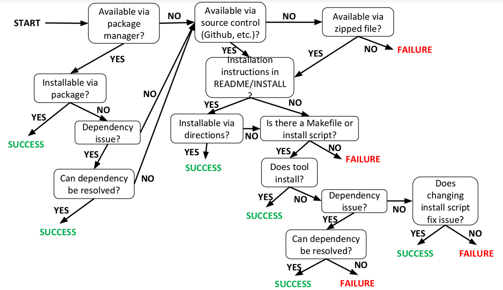

# Tool Installation

## Flow chart



## Virtual Machine

For the software crisis project, we’d like to see how many bioinformatics tools can be easily installed. We would like to use a common platform for this, so that everyone is trying to install using the same operating system flavor and version, and ideally root access would be nice to have.

The idea is to use a virtual machine, and we can use the same base image to ensure we’re on the same page. I recommend using Vagrant, which is a lightweight command line virtual machine that can be spun up using a configuration file that we can all share.
Vagrant can be downloaded [here](https://www.vagrantup.com/downloads.html)

The important commands are:
* `vagrant up`, which you run in the directory containing the VagrantFile (the config file) and it starts the virtual machine
* `vagrant ssh`, which will ssh you into the virtual machine
* `vagrant suspend`, which suspends the machine (essentially freezes it, but doesn’t shut it down)
* `vagrant halt`, which shuts the machine down
* `vagrant provision`, which runs the provision.sh script (for our use case, this installs basic command line tools)

I’ve included a VagrantFile to use, it can be configured to use more/less memory/cores of your machine depending on your preferences.
We’ll use CentOS 7, as it’s a typical OS for servers to run. If you run the command “vagrant box update” you should see that you’re using v1710.01 as that’s the latest version.

The directory containing the VagrantFile is mounted in the VM at the directory /source so you can easily move files in/out of the VM if you would like.  To enable this, run these commands after installing the VM:
* `vagrant plugin install vagrant-vbguest`
* `vagrant vbguest`

Note that the provison.sh script is used for installing several software packages that are commonly found on most machines. Please see this file for a list of the packages.

# Categorizing the tools

We will categorize the tools as
- **easy to install**, which can be installed in less than 5 minutes
- **hard to install**, which can be installed in more that 5 minuted
- **impossible to install**


## Testing phase

After installation, we want to make sure that the tool was installed properly. To this end, we will run a minimal test that exemplifies the most common and basic usage of that tool. Below we define the tests per domain.


#### HTS Mapping

For HTS mapping, creating an index and then aligning reads is the most basic operation needed. The data used was the lambda phage virus' genome and sample reads obtained from Bowtie's home page (I'll update here the actual reference!). Here's an example of how to perform this test:

```
# Indexing a reference genome
wget https://raw.githubusercontent.com/BenLangmead/bowtie2/master/example/reference/lambda_virus.fa
# Downloading reads
wget https://github.com/BenLangmead/bowtie2/raw/master/example/reads/reads_1.fq

# Use tool's CLI to align reads_1.fq using lambda_virus.fa as reference
```
